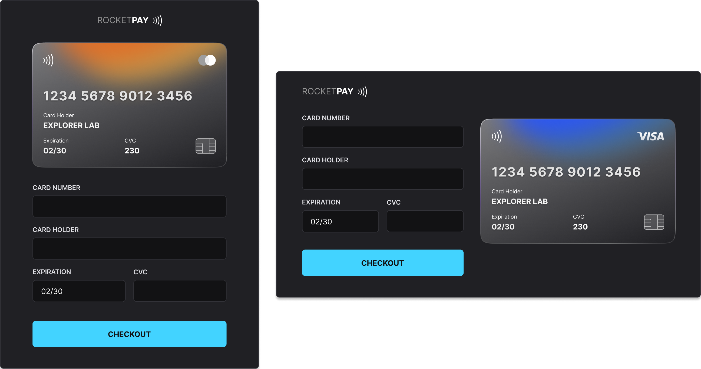

<!--Heading-->
<h1 align='center'> 
  
</h1>

  • <strong>RocketPay</strong> is a Component that simulates a <strong>Credit Card</strong> form, where you can add masking to inputs and update <strong>HTML</strong> elements via <strong>DOM</strong>.

  &nbsp;
  

 
<!--/Heading-->

<!--Section-->

  ⚙️ Languages and tools used in the project

  &nbsp;&nbsp;
  &nbsp;&nbsp;
  &nbsp;&nbsp;
  &nbsp;&nbsp;
  &nbsp;&nbsp;
  

 
<!--/Section-->

<!--Section-->

  

<!--/Section-->
